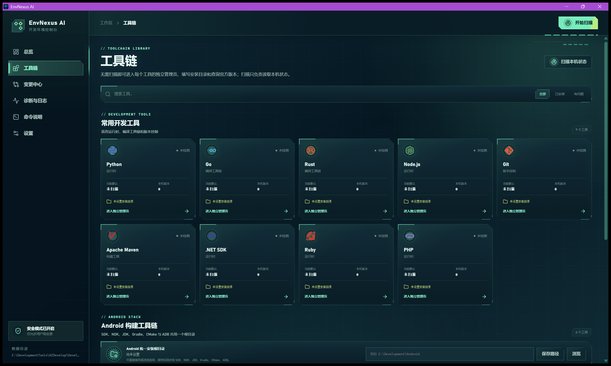

<p align="center">
  
</p>

<h1 align="center">EnvNexus AI</h1>

<p align="center">AI 辅助的 Windows 开发环境与多版本工具链管理器</p>

<p align="center">
  <a href="README.zh-CN.md">简体中文</a> |
  <a href="#english">English</a>
</p>

<p align="center">
  <a href="https://github.com/PuppetWen/EnvNexus-AI/releases/latest"></a>
  <a href="https://github.com/PuppetWen/EnvNexus-AI/releases"></a>
  <a href="https://github.com/PuppetWen/EnvNexus-AI/issues"></a>
  <a href="https://github.com/PuppetWen/EnvNexus-AI/stargazers"></a>
  
  
</p>



---

## 中文

EnvNexus AI 是一款使用 Rust + Tauri 2 开发的 Windows 桌面 App。它把常见开发工具的检测、官方版本查询、下载校验、自选目录安装、多版本切换、修复和卸载放到统一、安全且可回滚的工作流中。

### 主要功能

- 管理 Python、Java/JDK、Go、Rust、Node.js、Git、Maven、.NET SDK、Ruby、PHP，以及 Android SDK、NDK、JDK、Gradle、CMake、ADB。
- 每个工具都有独立页面和独立安装根目录；Android 组件集中使用同一个用户指定根目录。
- 显示当前默认版本、本机全部版本、官方可安装版本、安装位置和环境状态。
- 手动全机扫描会遍历所有本地固定磁盘并建立索引；App 启动时只读取快照，安装、切换和修复后使用文件指纹增量刷新。
- 增量刷新复用未变化工具的已验证版本，仅对新增或发生变化的可执行文件重新探测；手动全机扫描始终强制复核。
- 切换默认版本前显示用户级 PATH/环境变量差异、冲突、备份和确认计划；系统级修改默认拒绝。
- 支持断点续传、哈希校验、安全解压、暂存安装、失败回滚、环境备份、操作日志和诊断报告。
- 识别 pyenv-win、NVM for Windows、fnm、Volta、rustup、Jabba、goenv、rbenv、Uru 等版本管理器，并在诊断和修复建议中保护它们的 shim、链接与根目录。
- 生成 `jdk-list`、`python-install`、`env-diagnose` 等 CMD 脚本；脚本调用同一个主程序，可从任意新开的 CMD 或 PowerShell 使用。
- 支持现代科技、赛博朋克、日系轻量、游戏 HUD、专业极简主题，以及简体中文、繁体中文、English、日本語、한국어界面。
- 支持托盘菜单、开机自启动、关闭到托盘、单实例运行和恢复上次离开的页面。

### AI 在哪里起作用

没有配置 AI 时，本地规则引擎仍会分析 PATH 重复/失效/遮蔽、默认版本冲突、用户级与系统级变量冲突、版本管理器接管状态，以及 `RUST1`、`RUST2` 这类自定义别名。

配置 AI 后，可将用户明确选择的单条诊断及其本机证据发送给当前 AI 厂商，生成更有针对性的冲突解释、风险说明、修复步骤和可复制命令。支持 OpenAI、Anthropic/Claude、Kimi、DeepSeek、智谱 GLM、xAI/Grok、Qwen、Google Gemini 和第三方兼容服务。每个厂商的 URL、协议、模型和密钥独立保存，Windows 下密钥使用 DPAPI 保护。

AI 不会绕过本地安全边界：它不能直接修改环境。任何一键修复仍必须经过本地规则校验、差异预览、备份和用户确认。

### 下载与启动

从 [GitHub Releases](https://github.com/PuppetWen/EnvNexus-AI/releases/latest) 下载：

- `EnvNexus-AI_0.1.4_x64-setup.exe`：当前用户安装版，可选择安装目录；检测到已有安装时会复用原路径并原地升级。
- `EnvNexus-AI_0.1.4_x64-portable.exe`：便携主程序；App 内更新会在原路径安全自替换。
- `SHA256SUMS.txt`：下载文件校验值。

首次打开不会扫描电脑。可先进入“工具链”为各工具设置目录，再按需扫描或查询官方版本。

### 终端命令

在“命令说明”页选择脚本目录，生成脚本并确认把该目录加入用户 PATH。重新打开终端后可运行：

```powershell
env-tools
jdk-list
jdk-root set "E:\DevelopmentTools\Java"
jdk-install 21.0.8
python-list
env-scan
env-refresh
env-diagnose
env-repair "PATH_DUPLICATE_用户"
```

`env-scan` 强制重建全机索引并验证全部候选；`env-refresh` 使用索引和文件指纹快速刷新。安装、切换、修复和卸载命令不带 `--yes` 时只生成预览计划。

### App 内更新

App 启动后会连接本仓库的最新 GitHub Release 检查版本，“设置 → 应用更新”也支持手动重试。用户确认更新后，App 会自动续传或重试下载，校验 SHA-256 与内置公钥签名；安装版静默覆盖原安装目录，便携版在原路径安全自替换。替换前会保留旧主程序，新版本未能完成启动确认时自动回滚；启动成功后自动清理备份和更新包。

### 从源码构建

要求 Windows 10/11、Node.js、pnpm、Rust stable、Visual Studio 2022 C++ Build Tools 和 Windows SDK：

```powershell
pnpm install
.\scripts\Verify.ps1
.\scripts\Invoke-Rust.ps1 -Task tauri
```

正式更新包必须使用长期保管的 Tauri updater 私钥签名。私钥不得提交到仓库；公钥已嵌入 App。详见[构建说明](docs/BUILDING.md)。

### 安全说明

EnvNexus AI 不会自动整理用户的现有开发目录，也不会静默写系统 PATH。写操作默认限制在用户级环境；系统级配置必须由用户另行明确决定。环境变更只会影响之后启动的终端和进程。

更多文档：[中文 README](README.zh-CN.md) · [更新日志](CHANGELOG.md) · [使用说明](docs/USER_GUIDE.md) · [构建说明](docs/BUILDING.md) · [架构设计](docs/ARCHITECTURE.md) · [安全模型](docs/SECURITY_MODEL.md) · [测试报告](docs/TEST_REPORT.md) · [已知限制](docs/KNOWN_LIMITATIONS.md) · [第三方许可](THIRD_PARTY_NOTICES.md)

---

## English

EnvNexus AI is a Windows desktop application built with Rust and Tauri 2. It provides one safe, reversible workflow for detecting, installing, switching, repairing, and uninstalling development toolchains.

### Highlights

- Manages Python, Java/JDK, Go, Rust, Node.js, Git, Maven, .NET SDK, Ruby, PHP, and the Android SDK/NDK/JDK/Gradle/CMake/ADB toolchain.
- Gives every tool its own management page and selectable installation root. Android components share one user-selected root.
- Shows the current default, every locally installed version, official releases, locations, and environment health.
- Full scans index every local fixed disk without relying on preset installation paths. Startup restores the last snapshot without traversing disks.
- Fingerprinted incremental refreshes re-run only changed tools while the active PATH defaults are always verified live.
- Previews user PATH/environment changes, conflicts, backups, and confirmation plans before switching a default version. System-level writes are denied by default.
- Supports resumable downloads, checksum verification, safe extraction, staged commits, rollback, logs, backups, and diagnostics.
- Detects existing managers such as pyenv-win, NVM for Windows, fnm, Volta, rustup, Jabba, goenv, rbenv, and Uru.
- Generates commands such as `jdk-list`, `python-install`, and `env-diagnose` for any new CMD or PowerShell session.
- Includes five distinct themes, five UI languages, a tray menu, launch at login, close-to-tray behavior, single-instance handling, and last-page restoration.

### What AI does

The local rule engine works without AI and diagnoses duplicate, missing, or shadowed PATH entries, default-version conflicts, user/system variable conflicts, version-manager ownership, and custom aliases such as `RUST1` and `RUST2`.

When AI is configured, the user can explicitly send one selected finding and its machine-specific evidence to the active provider. AI then produces a contextual explanation, risk assessment, repair steps, and copyable commands. OpenAI, Anthropic/Claude, Kimi, DeepSeek, GLM, Grok, Qwen, Gemini, and compatible third-party endpoints are supported. Every provider keeps an independent URL, protocol, model, and DPAPI-protected key.

AI cannot bypass local safety controls or directly change the environment. One-click repair still requires local validation, a diff preview, a backup, and user confirmation.

### Download and use

Download the latest build from [GitHub Releases](https://github.com/PuppetWen/EnvNexus-AI/releases/latest):

- `EnvNexus-AI_0.1.4_x64-setup.exe`: per-user installer with a selectable install directory. Existing installations are upgraded in their previous location.
- `EnvNexus-AI_0.1.4_x64-portable.exe`: portable executable. In-app updates safely replace it in its original location.
- `SHA256SUMS.txt`: release checksums.

The first launch does not scan the machine. You can configure each tool's installation root before running a scan or querying official releases.

### Terminal commands

Choose a script directory on the “Commands” page, generate the scripts, and confirm its addition to the user PATH. Open a new terminal:

```powershell
env-tools
jdk-list
jdk-root set "E:\DevelopmentTools\Java"
jdk-install 21.0.8
python-list
env-scan
env-refresh
env-diagnose
```

`env-scan` rebuilds the whole-computer index and force-verifies every candidate. `env-refresh` performs a fingerprinted incremental refresh. Mutating commands only print a preview unless `--yes` is explicitly supplied.

### In-app updates

EnvNexus AI checks the latest GitHub Release once after the interface opens. The brand status dot stays green when the current version is up to date and turns red when an update is available. After confirmation, downloads resume or retry automatically and are verified with SHA-256 plus the embedded public key. Installed builds update silently in place; portable builds replace themselves in their original location. The previous executable is retained until the new version confirms startup, then backups and update packages are removed automatically.

### Build from source

Windows 10/11, Node.js, pnpm, stable Rust, Visual Studio 2022 C++ Build Tools, and the Windows SDK are required:

```powershell
pnpm install
.\scripts\Verify.ps1
.\scripts\Invoke-Rust.ps1 -Task tauri
```

Production update artifacts must be signed with a long-lived Tauri updater private key. Never commit that key; the corresponding public key is embedded in the application. See [Building](docs/BUILDING.md).

### Security boundary

EnvNexus AI does not reorganize existing development directories or silently write the system PATH. Mutations are user-scoped by default, and system-level changes require a separate explicit decision. Environment changes apply only to subsequently started terminals and processes.

More documentation: [Chinese README](README.zh-CN.md) · [Changelog](CHANGELOG.md) · [User guide](docs/USER_GUIDE.md) · [Building](docs/BUILDING.md) · [Architecture](docs/ARCHITECTURE.md) · [Security model](docs/SECURITY_MODEL.md) · [Test report](docs/TEST_REPORT.md) · [Known limitations](docs/KNOWN_LIMITATIONS.md) · [Third-party notices](THIRD_PARTY_NOTICES.md)
