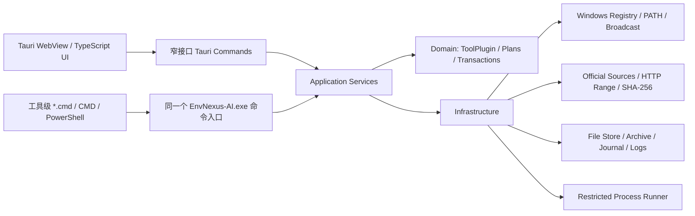

# EnvNexus AI 架构设计

## 技术选型

- 桌面框架：Tauri 2
- 后端：Rust stable，`x86_64-pc-windows-msvc`
- 前端：Vanilla TypeScript + Vite
- Windows 接口：`winreg` 与 `windows-sys`
- 网络：`reqwest`（Rustls）
- 持久化：版本化 JSON 文档；操作日志使用 JSON Lines
- 下载校验：SHA-512、SHA-256、SHA-1
- 压缩包：ZIP、tar.gz、7z；安装器类包通过受控进程执行

Vanilla TypeScript 足以承载当前的信息架构和主题系统，依赖面比大型前端框架更小。Rust 后端负责编排注册表、PATH、下载、校验、解压、进程与回滚，避免把高权限能力暴露给 WebView。

## 分层



前端不能传入任意命令行、注册表键或下载后执行参数。所有可执行动作必须由已注册插件生成类型化计划。

EnvNexus AI 只构建一个 Windows 主程序。无参数启动时进入 Tauri GUI；携带内部命令参数时进入同一 crate 的命令入口。用户选择的命令目录（默认 `<data-root>/commands`）下，工具级 CMD 脚本固定转发到这个 `EnvNexus-AI.exe`，例如 `jdk-list.cmd` 转为 `EnvNexus-AI.exe list java`。脚本只保存主程序位置与工具 ID，不保存工具安装根目录；每次执行时读取 `tool-roots.json` 的最新设置。查询命令读取共享快照，显式 `env-scan` 才调用扫描器；变更命令只有 `--yes` 才能消费刚生成的确认计划。

命令页负责生成/修复脚本，并使用普通 `OperationPlan` 预览命令目录加入或移出 HKCU 用户 PATH 的差异。脚本本身不写 HKLM 或系统 PATH。

## 核心领域模型

### `ToolPlugin`

每一种工具通过 `ToolDescriptor + ToolPlugin` 暴露统一元数据、官方版本源和能力开关；扫描、计划、事务与诊断由共享服务按 descriptor 执行：

```text
descriptor
capabilities
fetch_available_versions
shared detect/diagnose
shared plan_install/plan_switch/plan_repair/plan_uninstall
```

插件不直接修改系统。应用服务负责生成计划、确认、记录、执行、验证和回滚。MVP 的编译期插件避免加载未签名第三方代码。

### `ToolInventory`

统一描述：

- 当前命令解析到的默认版本；
- 所有发现的已安装版本；
- 每个版本的来源、路径、架构与健康状态；
- 环境变量/PATH 状态；
- 官方可安装版本及查询时间；
- 诊断问题与建议。

### `EnvironmentScan` 与版本管理器

完整扫描只由显式 Tauri 命令或 `env-scan` 触发，遍历所有本地固定磁盘并写入 `tool-executable-discovery.json`。安装、切换、修复、卸载和 `env-refresh` 调用增量扫描：重新读取注册表环境，检查 `tool-version-probes.json` 中的路径、大小、修改时间和伴随元数据，只对新增或变化候选运行版本命令。完整扫描不复用版本探测缓存。成功结果原子写入 `<data-root>/cache/last-environment-scan.json`；启动路径只反序列化快照，不调用扫描器。

环境规则还分析用户/系统 PATH、同名变量跨作用域冲突、Java 默认路径不一致，以及 `RUST1`/`RUST2` 一类“工具标识 + 绝对目录”的自定义别名。自定义别名只报告不自动合并，因为变量名的业务含义无法可靠推断。PATH 诊断修复通过环境变量推导保护路径，避免把版本管理器的 shim 或当前版本链接当作失效目录删除。

### `DiagnosticGuidance`

每个 `DiagnosticIssue` 可由本地纯规则扩展为 `DiagnosticGuidance`：原因与证据、本机适配因素、建议、可复制命令及是否允许本地一键修复。导出的 `DiagnosticReport` 包含扫描快照、机器上下文和所有本地 guidance。只有修改用户环境且结果唯一、可备份、可回滚的问题才会进入 `OperationPlan`；系统级、管理员权限或多解问题只提供只读命令和人工步骤。

### `OperationPlan`

计划是可序列化、可预览的步骤列表：

- 创建目录；
- 下载及期望哈希；
- 解压或执行受控安装器；
- 写入 App 安装清单；
- 修改用户级环境变量；
- 删除由 App 管理的版本；
- 执行验证命令。

每个计划包含：

- 唯一 ID 和过期时间；
- 当前环境快照指纹，防止确认后环境已变化；
- 影响范围；
- 冲突和警告；
- 回滚步骤；
- 是否需要管理员权限。

### `TransactionJournal`

操作状态：

```text
planned -> confirmed -> running -> verifying -> committed
                              \-> rolling_back -> rolled_back/failed
```

安装事务会持久化 journal；普通失败会清理暂存目录或恢复旧目录。MVP 尚未提供“应用崩溃后自动恢复未完成 journal”的 UI，见已知限制。

## 插件注册

MVP 使用编译期 Rust trait 注册表：

- `python`
- `java`（Eclipse Temurin）
- `go`
- `rust`
- `node`
- `git`
- `maven`
- `dotnet`
- `ruby`
- `php`
- `android-sdk`
- `android-ndk`
- `gradle`
- `cmake`
- `adb`

插件行为由 Rust 代码与数据清单共同定义。首版不加载第三方 DLL：Rust 没有稳定 ABI，且环境管理器具有执行安装器和修改 PATH 的能力，直接加载未签名本机代码风险过高。后续外部插件应采用签名 manifest + 受限子进程协议。

## 官方版本源

| 工具 | 官方源 |
| --- | --- |
| Python | python.org 下载 API/发行文件 |
| Java | Eclipse Adoptium API（Temurin） |
| Go | `go.dev/dl/?mode=json` |
| Rust | Rust 官方 channel manifest / rustup |
| Node.js | `nodejs.org/dist/index.json` |
| Git | Git for Windows 官方 GitHub Releases |
| Maven | Apache Maven 官方下载目录与 SHA-512 |
| .NET SDK | Microsoft .NET release metadata |
| Ruby | RubyInstaller 官方 GitHub Releases |
| PHP | PHP for Windows 官方发布目录与 SHA-256 |
| Android SDK/NDK/ADB | Google Android repository XML |
| Gradle | `services.gradle.org/versions` |
| CMake | Kitware CMake 官方 GitHub Releases |

所有在线结果都显示来源和查询时间。当前 MVP 每次显式查询都访问实时官方源；`cache/version-sources` 目录已预留，但尚未启用离线版本清单缓存。

## 多版本与默认切换

- App 管理的版本位于用户为该工具选择的根目录下：`<root>\<tool>\<version>`。
- 各工具安装根目录持久化到 `<data-root>/config/tool-roots.json`，后续安装计划只使用已保存的目录。
- Android 子工具强制位于同一个 Android 根目录。
- 切换默认版本时只修改用户级环境变量和用户 PATH。
- 环境变量变更采用“规范化 PATH 条目 + 有序差异”，不把 PATH 当普通字符串替换。
- 变更前备份 HKCU 环境快照；变更后广播 `WM_SETTINGCHANGE`。
- 已打开的终端不会自动重载进程环境，UI 必须明确提示新终端/新进程生效。
- EnvNexus AI 管理的 Rust 版本通过隔离的 `CARGO_HOME`、`RUSTUP_HOME` 与 PATH 切换；外部 rustup 工具链只做 PATH 级切换，不改写全局 rustup 配置。

## 数据目录

开发态默认使用仓库内 `.envnexus-ai-data`；正式版默认使用可执行文件旁的 `EnvNexusAIData`。设置页可选择新数据目录，写入安装目录旁的小型指针文件，重启后生效；不会静默迁移旧数据。为了原地升级，只有新位置不存在时才回退读取旧版 `.envpilot-data`、`EnvPilotData` 和旧指针。目录结构如下：

```text
<data-root>/
  config/
    app-preferences.json
    ai/
      active-provider.json
      providers/<provider>.json
      secrets/<provider>.dpapi.json
  cache/last-environment-scan.json
  cache/tool-executable-discovery.json
  cache/tool-version-probes.json
  cache/version-sources/
  downloads/
  logs/
  backups/environment/
  transactions/
  tools/
  commands/*.cmd
```

环境变量 `ENVNEXUS_AI_DATA_ROOT` 的优先级最高，便于便携部署和自动化测试；`ENVPILOT_DATA_ROOT` 是次级兼容入口。

## 窗口与托盘

- `main.rs` 在带参数时先进入终端命令入口；无参数 GUI 才进入 Tauri。单实例插件在所有其他 Tauri 插件之前注册，因此只限制 GUI，不会拦截 `jdk-list`、`tools --json` 等命令进程。
- 第二次 GUI 启动由单实例回调取消最小化、显示并聚焦现有 `main` 窗口，第二个进程正常退出；回调不发送导航动作，因此保留用户当前页面。
- Tauri 创建单个 `envnexus-ai-tray` 系统托盘图标。一级操作使用与前端 Lucide 导航对应的本地 PNG，工具项使用由品牌 SVG 预生成的本地 PNG；运行时不连接图标 CDN。
- 工具菜单按“工具链 → 工具 → 已安装版本”构造三级层级；诊断菜单按“诊断管理 → 诊断问题 → 查看详情/生成修复计划”构造三级层级。
- AI 菜单读取九个厂商的独立配置，只列出同时具备 DPAPI 密钥和已选模型的有效厂商；切换动作只更新 `active-provider.json`，不会重写其他厂商文件。
- 工具和版本层级只读取 `last-environment-scan.json` 与内存快照，不触发扫描。每个工具始终保留管理页入口；没有快照时显示“尚未扫描”占位项。
- 非默认版本菜单事件发出类型化 `previewSwitch` 动作，前端打开对应工具页并调用现有 `preview_switch`。最终执行仍经过计划 ID、环境指纹、差异预览、备份和用户确认。
- `openTool` 和 `previewSwitch` 在前端等待工具定义、目录偏好和缓存快照完成同一份初始化 Promise 后再导航，避免窗口恢复得比工具数据更快时渲染错误空状态。
- 诊断菜单聚合快照的全局问题和各工具问题。`openDiagnostic` 打开本地规则分析；`previewDiagnosticRepair` 只调用现有确定性修复计划，可修复标记为 false 时不创建修复入口。
- 关闭请求由 Rust 窗口事件处理器读取内存中的 `AppPreferences`；选择 `minimizeToTray` 时阻止关闭并隐藏窗口，选择 `exit` 时沿用原生关闭。
- 启动后隐藏由前端在事件监听和初始状态加载完成后调用，确保托盘恢复事件不会因 WebView 尚未初始化而丢失。
- 托盘“手动重新扫描”通过类型化 `scan` 动作进入现有显式扫描流程；其他托盘动作只导航、恢复窗口或预览切换。
- `AppPreferences` 持久化关闭行为、启动后隐藏、开机自启和界面语言。只有用户保存开机自启设置时，后端才写入/删除 HKCU 当前用户 `Run\EnvNexus AI`；写配置文件失败时会恢复先前启动项状态。

## 前端信息架构

- 仪表盘：环境健康分数、默认工具链、冲突、最近操作。
- 工具链总览：常用开发工具与 Android 构建工具链分组展示，不混用单张明细表。
- 工具独立管理页：每个工具分别查看默认版本、所有安装、官方版本、状态和默认安装根目录。
- Android 根目录：作为工具链分组内的共享设置，统一约束 SDK/NDK/JDK/Gradle/CMake/ADB，不设置单独顶层导航。
- 变更中心：差异预览、确认、执行进度、回滚。
- 诊断与日志：结构化问题、本地原因/建议、可复制命令、安全修复计划、AI 增强分析和完整报告导出。
- 命令说明：15 个工具的命令分组、脚本完整性、用户 PATH 启用/停用计划。
- 设置：紧凑两列的应用/启动/语言控制、数据根目录、主题和 AI 厂商连接。网络代理沿用系统/Reqwest 默认行为，暂未提供代理凭据或并发配置 UI。

所有主视图位于同一个固定高度纵向滚动容器中，显式显示滚动条；前端还处理真实滚轮事件，以兼容 WebView 中默认滚动链失效的情况。

前端每次渲染都会同步保存当前主视图、工具详情 ID 和设置页 AI 厂商到带 schema 版本的 `envnexus-ai.navigation`。启动时先做白名单解析，再在工具定义加载后复核工具 ID；非法值回退总览，不完整的工具详情回退工具链。首次升级会读取并迁移旧的 `envpilot.navigation`。

五套主题通过同一组语义 design tokens 实现，同时为背景、面板、边框、装饰纹理和形状提供各自的视觉变体：

- `modern-tech`
- `cyberpunk`
- `japanese-light`
- `game-hud`
- `professional-minimal`

## AI 适配层

AI 配置由 Rust 后端持久化。内置 OpenAI Compatible、Anthropic Messages 和 Gemini generateContent 三种协议，映射到 OpenAI、Claude、Kimi、DeepSeek、GLM、Grok、Qwen、Gemini 与可编辑第三方入口。模型列表由用户显式请求；无标准列表接口时允许手动模型 ID。

API Key 使用 Windows DPAPI 加密，WebView 只获得 `apiKeyConfigured` 布尔值。AI 使用禁止重定向的独立 HTTPS 客户端。诊断请求从已保存扫描快照定位单条问题，并附带相关安装版本/路径、版本管理器、机器架构和本地 `DiagnosticGuidance`。AI 返回值只作为增强文本展示，不进入 `OperationPlan`；无 AI 时本地 guidance 路径不变。因此 AI 无法绕过本地计划确认、环境指纹、备份或系统级写入禁令。

## 可测试性

- 领域计划生成与 PATH diff 为纯函数，使用 Rust 单元测试。
- Android 官方源解析使用固定 fixture，另有 15 工具官方源的显式联网测试及新增四源的独立联网测试。
- Python 官方嵌入包有显式联网端到端测试，覆盖下载、SHA-256、安全解压、清单、版本验证与提交。
- 环境差异与 PATH 清理使用纯函数测试；实际 HKCU 写入只通过交互式确认路径执行，本次开发未改动现有环境。
- 扫描快照往返测试确保读取缓存不会调用扫描器；手工冒烟使用全新数据目录验证首次启动无快照、点击后生成快照、重启不改写快照。
- AI 测试覆盖 OpenAI Compatible/Gemini 模型响应解析、内置厂商合并、非 HTTPS URL 拒绝和 Windows DPAPI 加解密。
- 命令隔离冒烟覆盖 110 个 CMD 脚本生成、无快照查询不扫描、15 工具定义、`jdk-list.cmd` 映射、`env-refresh.cmd` 增量刷新、`env-repair.cmd` 预览、先生成脚本后修改工具目录仍读取最新配置、显式扫描、快照复用和无 `--yes` 的修复预览。
- 托盘冒烟覆盖初始化期间打开 Python、15 工具动态层级、关闭到托盘、立即隐藏、启动后隐藏、开机自启注册表写入/删除、五种语言和直接退出，以及所有启动路径均不自动扫描。
- 单实例冒烟覆盖第二个 GUI 进程退出、原进程保持、隐藏窗口恢复、15 工具命令模式不被拦截，以及全过程不扫描。
- 手动扫描冒烟断言托盘可切换版本、诊断问题和可修复诊断入口数量分别与缓存一致，并通过托盘事件实际打开诊断建议与修复计划；同一脚本还验证黑橙蜂窝游戏 HUD 和重启恢复 Java/JDK 详情页。
- 前端使用 Vitest 测试五主题定义、黑橙蜂窝游戏 HUD、最后界面状态的有效/无效读取、界面本地化不会改写 `data-*` 属性，以及 15 个内置工具均有品牌 SVG。
- 最终执行 `cargo test`、前端测试、`cargo clippy`、生产构建和 Tauri bundle。
